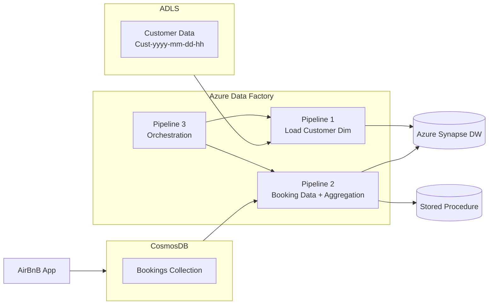

# AirBnB CDC Processing 🚀

This project demonstrates a **Change Data Capture (CDC) data pipeline** for Airbnb-like booking data using **Azure services**.
The pipeline ingests customer and booking data, performs transformations, and stores it in **Azure Synapse Analytics** for reporting and analytics.

---

## 📌 Architecture



---

## ⚙️ Tech Stack

* **Python** – Mock data generation for Cosmos DB
* **Azure Cosmos DB** – Source for real-time bookings CDC
* **Azure Data Lake Storage (ADLS Gen2)** – Customer data storage (raw + archive)
* **Azure Data Factory (ADF)** – ETL orchestration and dataflows
* **Azure Synapse Analytics** – Data warehouse for dimensions, facts, and aggregations
* **SQL** – Schema design, stored procedures, aggregations
* **Faker** – Fake data generator for testing

---

## 📂 Project Structure

```
├── mock_data_in_cosmosdb.py     # Python script to generate mock booking data
├── synapse_tables.sql           # DDL for Synapse tables & stored procedures
├── adf/                         # JSON export of ADF pipelines (if exported)
├── README.md                    # Documentation
```

---

## 🛠️ Setup Instructions

### 1. Cosmos DB – Mock Data Generation

Run the script to insert **real-time booking events** into Cosmos DB.

```bash
pip install azure-cosmos faker
python mock_data_in_cosmosdb.py
```

This will generate bookings with fields like:

* `booking_id`, `customer_id`, `property_id`, `check_in_date`, `check_out_date`, `amount`, `currency`, `location`, `timestamp`

---

### 2. Synapse – Schema Setup

Run the SQL script in **Synapse dedicated SQL pool**:

```sql
-- Create schema
CREATE SCHEMA airbnb;

-- Dimension table
CREATE TABLE airbnb.customer_dim (...);

-- Fact table
CREATE TABLE airbnb.bookings_fact (...);

-- Aggregation table + stored procedure
CREATE TABLE airbnb.BookingCustomerAggregation AS ...
CREATE PROCEDURE airbnb.BookingAggregation AS ...
```

---

### 3. ADLS Setup

Create a container named **`airbnb`** with:

* `customer_raw_data/` – Raw customer files (CSV/Parquet)
* `customer_archive/` – Archived files
* `synapse_stage/` – Staging files

---

### 4. ADF Setup

Create **Linked Services**:

* `AirBnBAdls` → ADLS Gen2 container `airbnb`
* `AzureSynapseAnalytics1` → Synapse DWH
* `CosmosDB` → Cosmos DB database `AirBnB`

Create **Datasets**:

1. `BookingDataCosmos` → Cosmos container `bookings`
2. `BookingsFactData` → Synapse table `bookings_fact`
3. `CustomerDataRaw` → ADLS `customer_raw_data`
4. `CustomerDataArchive` → ADLS `customer_archive`
5. `CustomerDataSynapse` → Synapse table `customer_dim`

---

## 🔄 Pipelines

### Pipeline 1 – **LoadCustomerDim**

* Get Metadata (list raw customer files)
* ForEach → Copy Data → Upsert into `customer_dim`
* Copy Data → Archive folder
* Delete Activity → Remove processed raw files

### Pipeline 2 – **BookingDataTransformations**

* Source: `BookingDataCosmos`
* Conditional Split: flag bad records (e.g., `check_out_date < check_in_date`)
* Derived Columns: `stay_duration`, `full_address`, `booking_year`, `booking_month`
* Lookup: compare with existing Synapse fact table
* Alter Row: decide insert/update
* Sink: `bookings_fact` (upsert mode)
* Stored Procedure: `BookingAggregation` (refresh country-level aggregations)

### Pipeline 3 – **Orchestration**

* Execute **Pipeline 1**
* Execute **Pipeline 2**
* Send **Notification** (success/failure)

---

## 📊 Example Query

After the pipeline runs, aggregated results are available:

```sql
SELECT * FROM airbnb.BookingCustomerAggregation;
```

Sample output:

| Country | Total\_Bookings | Total\_Amount | Last\_Booking\_Date |
| ------- | --------------- | ------------- | ------------------- |
| USA     | 152             | 81,250.50     | 2025-09-06          |
| Germany | 73              | 32,100.00     | 2025-09-05          |
| Canada  | 91              | 45,880.00     | 2025-09-06          |

---

## 🚀 How to Run

1. Drop new **customer files** into `customer_raw_data/` → triggers Pipeline 1
2. **Cosmos DB** change feed automatically streams new booking events → Pipeline 2
3. Orchestrator (Pipeline 3) runs both pipelines and notifies upon completion

---

## ✅ Features

* Real-time **CDC ingestion** from Cosmos DB
* Incremental upserts into Synapse Fact table
* SCD-1 updates for `customer_dim`
* Data quality checks & bad record handling
* Country-level booking aggregations via stored procedure
* Automated file archival in ADLS
* Orchestrated multi-pipeline workflow

---

## 🔮 Future Enhancements

* Enable **Cosmos DB full-fidelity change feed** to capture deletes
* Add **Power BI dashboard** on Synapse tables
* Implement **incremental aggregations** instead of full refresh
* Replace row-level lookup with **staging + MERGE** for scale
* Use **Managed Identity** instead of keys for all linked services

---

## 👨‍💻 Author

Built by **\[Rohesen]** as part of a learning project on Azure Data Engineering 🚀

